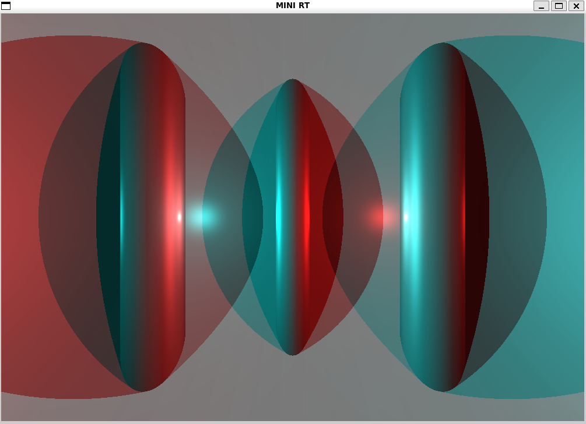
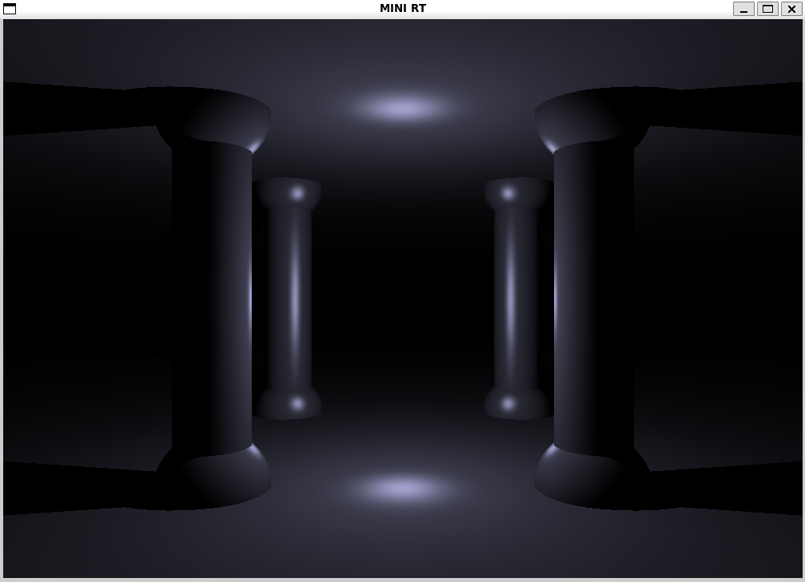
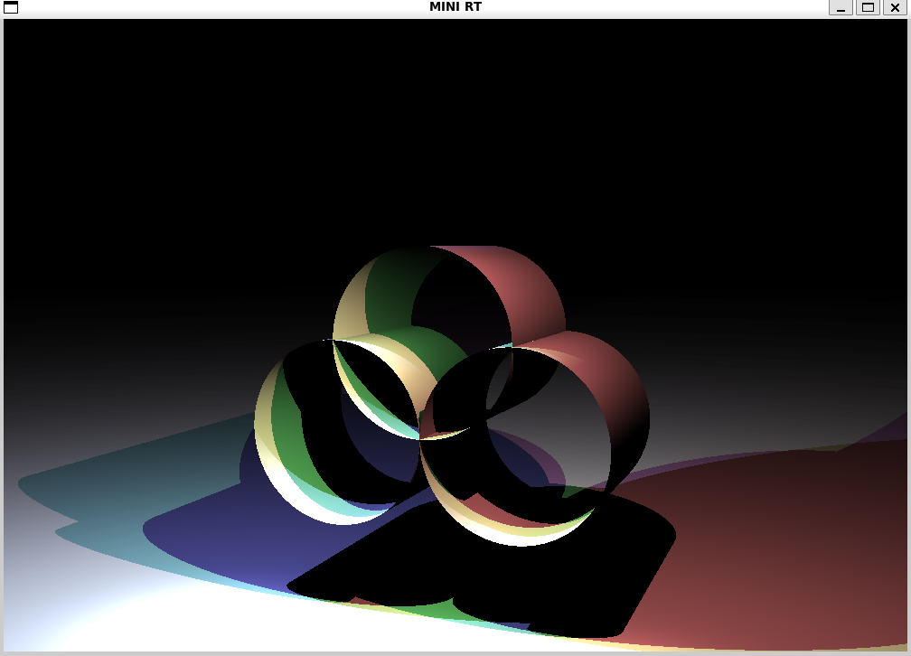

# miniRT: Mon premier RayTracer avec miniLibX

<div>
  
  
  
<div>

**Description** : Le but de ce programme est de générer des images en utilisant le protocole de Raytracing. 
Ces images générées par ordinateur représenteront chacune une scène, vue sous un angle et une position spécifiques, 
définis par des objets géométriques simples, chacun ayant son propre système d'éclairage.

## Installation

Pour exécuter le projet, un environnement Linux est requis. WSL2 est également pris en charge.

### Dépendances nécessaires pour la miniLibX

Avant de compiler et d'exécuter le projet, certaines dépendances sont nécessaires pour l'utilisation de la miniLibX.
Exécutez les commandes suivantes dans votre terminal pour installer ces dépendances :

```bash
sudo apt update
sudo apt install build-essential libx11-dev libglfw3-dev libglfw3 xorg-dev
```
**Liens vers le dépôts de la MiniLibX pour plus d'information sur l'installation**

- [MiniLibX](https://github.com/codam-coding-college/MLX42)

**Execution**

```bash
make re
./MiniRT {scene.rt disponible dans le dossier scene}
```

**Makefile** : 
Dans ce projet, le `Makefile` fournit plusieurs règles pour faciliter la compilation et la gestion du projet. 
Voici un aperçu de chaque règle et de son utilité :

- **all**: Compile le programme principal. C'est la règle par défaut exécutée lorsque vous lancez simplement `make`.
- **$(NAME)**: Compile les fichiers objets en un exécutable nommé selon la variable `NAME`. Dépend des objets et des bibliothèques.
- **$(OBJ_DIR)%.o** et **$(OBJ_DIR_DEBUG)%.o**: Compilent les fichiers source en fichiers objets. La version debug inclut des symboles de débogage.
- **clean**: Supprime tous les fichiers objets, nettoyant le projet de tout ce qui n'est pas du code source ou l'exécutable final.
- **fclean**: Exécute `clean` et supprime également l'exécutable final, permettant un redémarrage propre du projet.
- **re**: Exécute `fclean` suivi de `all`, permettant de recompiler le projet à partir de zéro.
- **sanitize**: Compile le projet avec la sanitisation d'adresse pour détecter les erreurs de mémoire.
- **debug**: Compile le projet en mode debug, permettant l'utilisation de débogueurs comme gdb ou lldb.
- **lib**: Compile les bibliothèques nécessaires au projet (par exemple, libft et MinilibX).
- **cleanlib** et **fcleanlib**: Nettoient et suppriment totalement les fichiers compilés des bibliothèques, respectivement.
- **add**: Script personnalisé pour mettre à jour la liste des fichiers source dans le projet.
- **create**: Interactif, ce script crée de nouveaux répertoires et fichiers source et les ajoute au projet.
- **obj** et **obj_debug**: Créent les répertoires pour les fichiers objets, en préparation pour la compilation.

Chaque règle est conçue pour faciliter une étape spécifique du développement, 
de la compilation à la gestion des dépendances et au débogage.

**Arguments** : une scène au format *.rt

**Contraintes** :
- Utilisation obligatoire de la miniLibX.
- Gestion fluide de la fenêtre (changement de fenêtre, minimisation, etc.).
- Prise en charge d'au moins trois objets géométriques simples : plan, sphère, cylindre.
- Gestion correcte de toutes les intersections possibles et de l'intérieur des objets.
- Capacité à redimensionner les propriétés uniques de l'objet.
- Capacité à appliquer des transformations de translation et de rotation aux objets, lumières et caméras.
- Gestion de la lumière : luminosité des spots, ombres dures, éclairage ambiant.
- Le programme doit afficher l'image dans une fenêtre et respecter certaines règles (utilisation de ESC pour fermer, gestion de la croix rouge, etc.).
- Le programme doit prendre comme premier argument un fichier de description de scène avec l'extension .rt.
